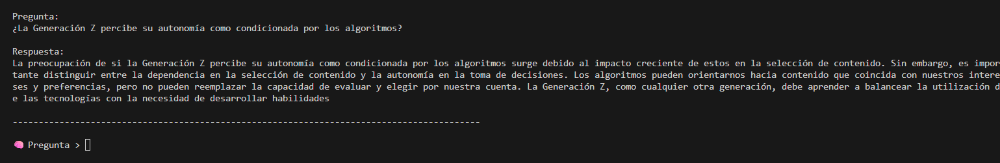

# Proyecto 3 – Inteligencia Artificial

## La Generación Z y la Crisis de Sentido en la Era Digital

### Análisis de Datos mediante Retrieval-Augmented Generation (RAG)

**Alumno:** Jorge González Bazán

**Carrera:** Ingeniería en Sistemas Computacionales

**Materia:** Inteligencia Artificial

**Institución:** Tecnológico de Morelia

**Profesor:** Jesús Eduardo Alcaraz Chávez

**Periodo:** Agosto–Diciembre 2025

---

## Resumen Ejecutivo

El presente proyecto implementa un sistema de *Retrieval-Augmented Generation (RAG)* con el objetivo de analizar discursos contemporáneos relacionados con la Generación Z, particularmente en torno a la crisis de sentido, la identidad digital y la autonomía frente a los algoritmos. A partir de un corpus textual compuesto por textos filosóficos normalizados y un conjunto complementario de datos sintéticos inspirados en discursos reales de redes sociales, se construyó un pipeline completo que integra limpieza de datos, generación de embeddings, almacenamiento vectorial, recuperación semántica, generación de respuestas mediante modelos de lenguaje y análisis visual del espacio semántico.

Los resultados muestran patrones discursivos consistentes con marcos teóricos del existencialismo, la posmodernidad y la crítica contemporánea a la tecnología, sugiriendo que la hiperconectividad y la mediación algorítmica influyen significativamente en la percepción de autonomía e identidad de la Generación Z.

---

## 1. Introducción

En la era digital contemporánea, la Generación Z se encuentra inmersa en un entorno caracterizado por la hiperconectividad, la abundancia de información y la presencia constante de algoritmos que median la experiencia cotidiana. Plataformas como TikTok, Instagram, Netflix o Spotify no solo organizan contenidos, sino que influyen activamente en la construcción del yo, en los hábitos de consumo y en la percepción de libertad individual.

Este proyecto parte de la hipótesis de que dichos entornos algorítmicos pueden estar contribuyendo a una crisis de sentido, entendida como una dificultad para construir proyectos vitales estables, identidad coherente y autonomía reflexiva. Para explorar esta problemática, se propone un enfoque interdisciplinario que combina filosofía contemporánea e inteligencia artificial mediante el uso de un sistema RAG.

---

## 2. Planteamiento del Problema

La pregunta central que guía este trabajo es:

> **¿Está la Generación Z viviendo una crisis de sentido debido a la hiperconectividad, el exceso de información y la mediación algorítmica?**

De manera complementaria, se plantea:

> **¿Estamos cediendo progresivamente nuestra autonomía a los algoritmos y sistemas de inteligencia artificial?**

Estas preguntas se abordan no desde la especulación teórica aislada, sino a partir del análisis empírico de discursos textuales utilizando técnicas modernas de procesamiento del lenguaje natural.

---

## 3. Marco Teórico

### 3.1 Existencialismo y vacío de sentido

Autores como Jean-Paul Sartre y Albert Camus sostienen que el ser humano se enfrenta a un mundo carente de significado intrínseco, siendo responsable de construir su propio sentido. En el contexto digital, esta responsabilidad puede verse diluida por la constante externalización de decisiones hacia sistemas automatizados.

### 3.2 Posmodernidad y fin de los metarrelatos

Jean-François Lyotard describe la posmodernidad como una condición marcada por la desconfianza hacia los grandes relatos unificadores. La fragmentación identitaria observada en entornos digitales parece reforzar esta idea, promoviendo identidades múltiples, temporales y performativas.

### 3.3 Identidad líquida y cultura del rendimiento

Zygmunt Bauman introduce el concepto de identidad líquida para describir la inestabilidad de los vínculos y compromisos en la modernidad tardía. Byung-Chul Han, por su parte, señala que la cultura del rendimiento y la autoexplotación generan fenómenos como el burnout y la ansiedad, especialmente visibles en generaciones jóvenes.

### 3.4 Tecnología, vigilancia y autonomía

Desde Foucault, la noción de biopoder permite interpretar los algoritmos como mecanismos de control sutil. Heidegger advierte que la tecnología moderna tiende a reducir al ser humano a recurso, mientras que Habermas alerta sobre la erosión del espacio público racional en entornos dominados por la lógica técnica.

---

## 4. Metodología

El proyecto adopta un enfoque exploratorio–interpretativo apoyado en técnicas de inteligencia artificial. La metodología se estructura en las siguientes etapas:

1. Definición de preguntas filosóficas de investigación.
2. Construcción y normalización de un corpus textual.
3. Generación de representaciones semánticas mediante embeddings.
4. Almacenamiento vectorial y análisis del espacio semántico.
5. Implementación de un sistema RAG para consultas discursivas.
6. Análisis visual y clustering de los textos.
7. Interpretación de resultados desde marcos filosóficos.

---

## 5. Corpus de Datos

El corpus utilizado se compone de dos fuentes principales:

* **dataset_normalizado.csv**: 187 textos en español, previamente limpiados y normalizados, con contenido filosófico y reflexivo relacionado con identidad, tecnología, ansiedad y sentido de vida.
* **dataset_sintetico.csv**: conjunto complementario de textos tipo *tweet*, generados con apoyo de inteligencia artificial (Grok) a partir de patrones discursivos reales, utilizados para enriquecer el espacio semántico y simular conversación digital contemporánea.

Esta combinación permite contrastar lenguaje académico con discurso cotidiano digital.

---

## 6. Arquitectura del Sistema

El sistema se organiza como un pipeline secuencial orquestado desde un archivo principal, integrando los siguientes módulos:

* Preprocesamiento textual
* Generación de embeddings con *Sentence Transformers*
* Almacenamiento vectorial mediante FAISS
* Recuperación semántica
* Generación de respuestas con un modelo de lenguaje
* Visualización y análisis semántico

El diseño separa el análisis estructural del espacio semántico (offline) de la interacción RAG en tiempo de consulta, permitiendo flexibilidad experimental.

---

## 7. Implementación Técnica

### 7.1 Generación de Embeddings

Se utilizó el modelo **all-mpnet-base-v2**, generando vectores densos de alta dimensión que capturan relaciones semánticas profundas entre los textos. El procesamiento se realizó por lotes para optimizar recursos.

### 7.2 Vector Store

Los embeddings fueron almacenados en un índice FAISS (*IndexFlatL2*), facilitando análisis posteriores y visualizaciones del espacio semántico.

### 7.3 Sistema RAG

Para la interacción discursiva se implementó un sistema RAG que combina:

* Recuperación semántica mediante similitud coseno.
* Generación de texto con el modelo **HuggingFaceH4/zephyr-7b-beta**.
* Un prompt no restrictivo orientado a respuestas reflexivas en español.

---

## 8. Resultados

Un ejemplo de interacción con el sistema es el siguiente:

**Pregunta:**
¿La Generación Z percibe su autonomía como condicionada por los algoritmos?

**Respuesta del sistema:**
La preocupación de si la Generación Z percibe su autonomía como condicionada por los algoritmos surge debido al impacto creciente de estos en la selección de contenido. Sin embargo, es importante distinguir entre la dependencia en la selección de contenido y la autonomía en la toma de decisiones. Los algoritmos pueden orientarnos hacia contenido que coincida con nuestros intereses y preferencias, pero no pueden reemplazar la capacidad de evaluar y elegir por nuestra cuenta.

---

## 9. Visualización y Análisis Semántico

Se aplicaron técnicas de reducción de dimensionalidad (t-SNE, UMAP) y clustering no supervisado (HDBSCAN) para identificar estructuras latentes en el corpus. Los resultados muestran agrupamientos temáticos relacionados con ansiedad digital, identidad fragmentada, control algorítmico y búsqueda de sentido.

Adicionalmente, se generaron grafos semánticos y nubes de palabras para reforzar la interpretabilidad de los clusters.

---

## 10. Discusión

Los patrones detectados respaldan parcialmente las hipótesis planteadas por autores como Byung-Chul Han y Bauman, evidenciando discursos de autoexigencia, fatiga y fragmentación identitaria. Asimismo, desde una lectura foucaultiana, los algoritmos pueden interpretarse como tecnologías de poder que orientan conductas sin coerción explícita.

---

## 11. Conclusiones

El proyecto demuestra que un sistema RAG puede ser utilizado no solo para recuperación de información, sino como herramienta analítica para explorar problemáticas filosóficas contemporáneas. Los resultados sugieren la existencia de una crisis de sentido en la Generación Z, influida por dinámicas algorítmicas que afectan la percepción de autonomía e identidad.

---

## 12. Trabajo Futuro

Como líneas futuras se propone:

* Integrar FAISS directamente en el loop de recuperación RAG.
* Ampliar el corpus con datos reales anonimizados.
* Incorporar análisis emocional más avanzado.
* Comparar discursos entre generaciones.

